# Swallow's Diamond 策划技术文档

更新时间：2026-07-09  
工程类型：Unity 2D / uGUI 解谜游戏  
Unity 版本：2022.3.62f2  
核心代码目录：`Assets/Scripts`  
核心配置目录：`Assets/StreamingAssets`、`Assets/levels`

## 0. 文档定位

本文档面向策划、程序和后续接手研发，说明当前工程里已经在用的代码结构、数据结构、玩法规则和流程推进方式。文档不是未来重构方案，也不把尚未拆分的类写成已实现模块；其中“当前实现”以代码真实状态为准，“建议分层”用于说明维护时应如何理解现有职责。

当前项目的主玩法代码仍集中在 `CarpetGridGame.cs` 中，它同时承担 data、controller、view 三层职责。文档会按功能模块拆解，但实际文件并没有完全按这些模块拆开。

## 1. 游戏整体框架流程

### 1.1 产品流程

游戏由 7 个体验阶段组成：

1. 开场演出：Logo、开始按钮、剧情文字、开场视频。
2. 引导动画：当前工程中由开场剧情和视频承担，没有单独的 Tutorial Scene。
3. 引导章节：当前工程中映射为章节一的前置关卡入口，仍使用同一套主玩法。
4. 第一章：章节按钮进入当前未完成关卡。
5. 第二章：上一章全部完成后解锁。
6. 第三章：上一章全部完成后解锁。
7. 结尾动画：当前工程尚未实现独立结尾动画 Scene，可复用开场视频/过渡层实现方式。

当前 Build Settings 里使用 3 个核心场景：

| 场景 | 文件 | 运行职责 |
| --- | --- | --- |
| Intro | `Assets/Scenes/Intro.unity` | 开场页、剧情文字、视频播放、过渡到主界面 |
| LevelSelectMenu | `Assets/Scenes/LevelSelectMenu.unity` | 章节按钮、章节解锁、设置、重置进度 |
| Main | `Assets/Scenes/Main.unity` | 棋盘关卡、拖动玩法、胜利检测、返回菜单 |

这 3 个场景本身基本作为空壳入口使用。核心 UI 和控制器由 `RuntimeInitializeOnLoadMethod` 在场景加载时自动创建。

### 1.2 运行时主流程

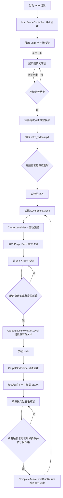

### 1.3 当前章节与关卡映射

章节入口来自 `Assets/StreamingAssets/Menu/menu_config.json`，当前配置如下：

| 章节按钮 | 关卡列表 | 解锁条件 |
| --- | --- | --- |
| 章节一 | 1, 2 | 默认解锁 |
| 章节二 | 3, 4 | 章节一关卡全部完成 |
| 章节三 | 5, 6 | 章节二关卡全部完成 |
| 章节四 | 7, 10 | 章节三关卡全部完成 |

章节按钮只会进入该章节当前未完成关卡。已经通关的关卡不能从菜单反复选择；菜单按钮代表章节进度，不是关卡列表。

### 1.4 核心玩法规则概述

棋盘上有多堆不同颜色的钻石堆。每堆钻石有一个剩余步数 `length`，代表它还能铺出多少个新格。玩家拖动钻石堆在上下左右相邻格移动，目标是在有限步数内让所有钻石堆停在同色目标格。

当前实现中的关键规则：

- 普通移动：进入空格，消耗 1 步，并把该格染成自己的颜色。
- 撤回：只能沿最近一步反向撤回，恢复被撤回格之前的颜色和归属，并返还该步消耗。
- 异色阻挡：默认不能进入异色路径格，也不能进入异色钻石堆所在格。
- 同色借道：目标格已有同色路径时可免费通过，不消耗步数。
- 同色终点堆借道：前方是同色且已经铺完 `length <= 0` 的钻石堆时，可以通过，不消耗步数。
- 钻石堆本体阻挡：同色但尚未铺完的钻石堆不能被穿过。
- 指定异色借道：关卡数据可给钻石堆配置 `passColor`，允许免费通过指定异色路径。
- 同组移动：同 `groupId` 的钻石堆会尝试同方向一起移动；如果其中某堆被阻挡，不会妨碍其他同组成员继续移动。
- 胜利条件：所有存活钻石堆 `length <= 0`，且当前位置等于各自目标格。

## 2. 工程入口与资源结构

### 2.1 关键脚本

| 文件 | 当前职责 |
| --- | --- |
| `Assets/Scripts/IntroSceneController.cs` | 开场页、剧情逐字显示、视频播放、过渡到菜单 |
| `Assets/Scripts/CarpetLevelMenu.cs` | 章节菜单、进度读取/保存、章节解锁、设置面板 |
| `Assets/Scripts/CarpetLevelFlow.cs` | 跨场景关卡请求、通关后推进、返回菜单、重置流程 |
| `Assets/Scripts/CarpetGridGame.cs` | 主玩法：关卡读取、棋盘状态、拖动、规则、渲染、胜利检测 |
| `Assets/Scripts/CarpetBgmPlayer.cs` | 跨场景 BGM 播放、音量设置、AudioListener 兜底 |
| `Assets/Editor/CarpetMenuLayoutEditor.cs` | 菜单配置编辑工具 |

### 2.2 关键数据与资源

| 路径 | 用途 |
| --- | --- |
| `Assets/levels/*.json` | 当前优先读取的正式关卡目录 |
| `Assets/StreamingAssets/Levels/*.json` | 备用关卡目录，只有 `Assets/levels` 不存在时才读取 |
| `Assets/StreamingAssets/Menu/menu_config.json` | 章节按钮、菜单背景、装饰图和菜单动画配置 |
| `Assets/StreamingAssets/Art/game_art_config.json` | 玩法场景的棋盘、背景、章节美术映射 |
| `Assets/StreamingAssets/Intro/intro_story_config.json` | 开场剧情、视频路径、Logo、开始按钮和过渡配置 |
| `Assets/Resources/Art` | 主玩法图片资源 |
| `Assets/Resources/Menu` | 菜单图片、装饰、动画帧资源 |
| `Assets/Resources/Intro` | 开场 Logo 与按钮资源 |
| `Assets/Resources/Audio/perfect_beauty_bgm.mp3` | 全局循环 BGM |

### 2.3 关卡 JSON 格式

```json
{
  "rows": 5,
  "cols": 5,
  "carpets": [
    {
      "id": 1,
      "row": 0,
      "col": 0,
      "targetRow": 0,
      "targetCol": 2,
      "length": 2,
      "color": "#e85d64",
      "groupId": "",
      "passColor": ""
    }
  ]
}
```

也兼容包裹格式：

```json
{
  "level": {
    "rows": 5,
    "cols": 5,
    "carpets": []
  }
}
```

字段说明：

| 字段 | 说明 |
| --- | --- |
| `rows` / `cols` | 棋盘行列数 |
| `id` | 钻石堆唯一 ID |
| `row` / `col` | 初始行列，0 基坐标 |
| `targetRow` / `targetCol` | 目标格行列，0 基坐标 |
| `length` | 剩余可铺格数，也就是步数资源 |
| `color` | 钻石堆颜色，HTML Hex |
| `groupId` | 同组移动 ID，空字符串代表不联动 |
| `passColor` | 可免费通过的指定异色路径颜色，空字符串代表无 |

## 3. 模块一：开场与结尾演出动画

### 3.1 当前实现范围

当前已实现开场演出，未实现独立结尾演出。开场由 `IntroSceneController` 完成：

- 进入 `Intro` 场景后自动创建控制器和 Canvas。
- 读取 `Assets/StreamingAssets/Intro/intro_story_config.json`。
- 展示 Logo 与开始按钮。
- 点击开始后进入剧情文字层。
- 剧情文本以逐字效果显示。
- 剧情结束后点击播放 `intro_video.mp4`。
- 视频播放完成后显示过渡层并加载 `LevelSelectMenu`。
- 切到主界面前会通过 `CarpetLevelFlow.RequestMenuGuide(GuideTextType.StartGame)` 预约一次开场引导气泡。
- 视频无法准备时，8 秒超时后跳过视频进入过渡层。
- 视频音频输出被关闭，BGM 由 `CarpetBgmPlayer` 全局播放。

结尾演出当前建议复用同一思路：新增结尾配置、视频和场景入口，或在章节四最后一关通关后由 `CarpetLevelFlow` 分支到结尾场景。

### 3.2 当前代码分层

| 层 | 当前类 | 说明 |
| --- | --- | --- |
| Data | `IntroConfig`、`IntroStoryPage` | JSON 反序列化数据，包含视频路径、按钮资源、剧情页、过渡配置 |
| Controller | `IntroSceneController` | 场景自动创建、点击状态机、视频播放、剧情推进、跳菜单 |
| View | 动态创建的 Canvas / RawImage / Text / Button | Logo、开始按钮、视频画面、剧情文字、过渡层 |

### 3.3 核心类与属性方法

#### `IntroSceneController`

核心属性：

| 属性 | 作用 |
| --- | --- |
| `config` | 开场 JSON 配置数据 |
| `videoPlayer` | Unity `VideoPlayer`，播放 StreamingAssets 下的视频 |
| `videoTexture` | 视频渲染用 `RenderTexture` |
| `videoImage` / `videoRect` | 视频显示控件与尺寸控制 |
| `titleLayer` | Logo 与开始按钮层 |
| `overlayLayer` | 剧情文字遮罩层 |
| `storyList` | 剧情文本容器 |
| `storyHint` | 点击提示文本 |
| `transitionLayer` | 进入菜单前的淡入过渡层 |
| `pageIndex` | 当前剧情页索引 |
| `revealRoutine` | 当前逐字显示 Coroutine |
| `state` | `Landing`、`Story`、`AwaitingVideoClick`、`Video`、`Transition` |

核心方法：

| 方法 | 作用 |
| --- | --- |
| `EnsureIntroExists()` | 场景加载后确保控制器和 EventSystem 存在 |
| `BuildUi()` | 动态创建开场 Canvas、Logo 层、剧情层、过渡层 |
| `BuildVideoPlayer()` | 创建 VideoPlayer，配置 URL、RenderTexture 和回调 |
| `StartStory()` | 从落地页进入剧情层 |
| `HandleStoryClick()` | 处理剧情层点击：补完逐字、翻页、进入待播放视频状态 |
| `RevealLineRoutine()` | 按 `lineRevealSeconds` 逐字显示剧情文本 |
| `StartVideo()` | 隐藏剧情层并播放视频 |
| `PlayWhenPrepared()` | 等待视频准备，最多 8 秒，失败则跳过 |
| `HandleVideoEnded()` | 视频结束后进入过渡 |
| `PlayTransitionThenMenu()` | 淡入过渡层，然后加载 `LevelSelectMenu` |

### 3.4 开场流程图

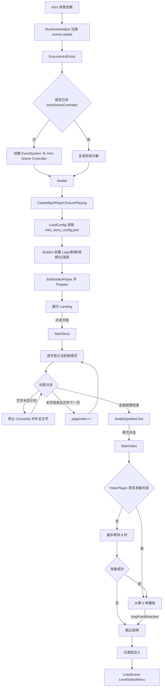

### 3.5 结尾演出接入设计

当前代码没有结尾 Scene。若按现有结构最小成本接入：

| 位置 | 修改方向 |
| --- | --- |
| `CarpetLevelFlow.CompleteActiveLevelAndReturn()` | 当章节四最后一关完成时，不返回菜单，改为加载 `Ending` 场景 |
| 新 `EndingSceneController` | 复用 `IntroSceneController` 的 VideoPlayer、过渡层、点击跳过逻辑 |
| 新配置 | `Assets/StreamingAssets/Ending/ending_config.json` |
| 通关判断 | 可根据 `RequestedButtonIndex == 3` 且章节四进度达到 `levels.Length` 判断 |

建议结尾状态机与开场保持一致：`Landing` 可省略，直接 `Video -> Transition -> Menu/Intro`。

## 4. 模块二：主界面章节按键解锁

### 4.1 当前实现范围

主界面由 `CarpetLevelMenu` 完成：

- 场景加载时优先实例化 `Resources/Prefabs/Carpet Level Menu`，绑定现有 UI 节点；旧版动态造 UI 逻辑仍保留在代码里作为兜底。
- 读取 `menu_config.json`，最多取前 4 个按钮。
- 每个按钮对应一个章节和一组线性关卡。
- `PlayerPrefs` 保存每个章节已完成关卡数量。
- 第一个章节默认开放。
- 后续章节只有前一章全部完成后开放。
- 当前章节按钮点击后进入该章节当前进度关卡。
- 完成的章节按钮显示已完成且禁用。
- 未解锁章节按钮显示未解锁且禁用。
- 菜单 `Start()` 会尝试消费 `CarpetLevelFlow` 暂存的引导类型，并驱动 `GuideLayerController` 弹出引导气泡。
- 设置面板支持音效、声音、震动开关，以及重置游戏。

### 4.2 当前代码分层

| 层 | 当前类 | 说明 |
| --- | --- | --- |
| Data | `MenuConfig`、`MenuButtonConfig`、`MenuDecorationConfig`、`MenuAnimationConfig` | 菜单 JSON 配置 |
| Data | `GuideDialogueConfig`、`GuideTextType` | 引导文案资产与引导类型枚举 |
| Controller | `CarpetLevelMenu`、`CarpetLevelFlow`、`GuideLayerController` | 章节状态判断、进度保存、开始关卡、引导弹层驱动 |
| View | 菜单预制体、章节 Button、设置面板、装饰图、帧动画、引导遮罩/气泡 | 菜单实际显示 |

### 4.3 核心类与属性方法

#### `CarpetLevelMenu`

核心常量：

| 常量 | 作用 |
| --- | --- |
| `ConfigPath = "Menu/menu_config.json"` | 菜单配置路径 |
| `ProgressKeyPrefix = "carpet-menu-progress-"` | 章节进度 PlayerPrefs 前缀 |
| `SoundKey = "carpet-setting-sound"` | BGM 开关 |
| `SfxKey = "carpet-setting-sfx"` | 音效开关，当前只保存设置 |
| `VibrationKey = "carpet-setting-vibration"` | 震动开关，当前只保存设置 |
| `ChapterButtonCount = 4` | 当前主界面固定 4 个章节按钮 |

核心属性：

| 属性 | 作用 |
| --- | --- |
| `buttonProgress` | 静态数组，记录每个章节完成了几个关卡 |
| `buttonConfigs` | 章节按钮配置，来自 JSON 或默认配置 |
| `decorationConfigs` | 菜单装饰图配置 |
| `animationConfigs` | 菜单背景动画配置 |
| `settingsPanel` | 设置面板根节点 |

核心方法：

| 方法 | 作用 |
| --- | --- |
| `ApplyJsonConfig()` | 读取菜单背景、按钮、装饰、动画配置 |
| `BuildUi()` | 创建菜单背景、装饰层、动画层、4 个章节按钮、设置按钮 |
| `GetButtonConfig(index)` | 获取按钮配置，不存在时使用默认章节映射 |
| `GetChapterState(index)` | 返回 `Open`、`Locked`、`Completed` |
| `StartConfiguredLevel(buttonIndex)` | 根据章节进度选择该章节当前关卡，调用 `CarpetLevelFlow.StartLevel` |
| `AdvanceButtonProgress(buttonIndex)` | 通关后推进指定章节进度 |
| `LoadProgress()` / `SaveProgress()` | 从 PlayerPrefs 读写章节进度 |
| `ResetSavedProgress()` | 清空全部章节进度 |
| `ApplySoundSetting()` | 将声音设置同步到 `CarpetBgmPlayer` |

#### `CarpetLevelFlow`

核心属性：

| 属性 | 作用 |
| --- | --- |
| `RequestedLevel` | 即将进入的关卡号 |
| `RequestedButtonIndex` | 发起关卡的章节按钮索引 |
| `IsTransitioning` | 防止重复加载场景 |
| `pendingMenuGuideType` | 切场景时暂存一次菜单引导类型 |

核心方法：

| 方法 | 作用 |
| --- | --- |
| `StartLevel(buttonIndex, level)` | 记录章节索引和关卡号，加载 `Main` |
| `ConsumeRequestedLevel()` | `Main` 场景启动时读取并清空请求关卡 |
| `RequestMenuGuide(guideType)` | 预约下一次进入菜单时要显示的引导文案 |
| `TryConsumePendingMenuGuide(out guideType)` | 菜单启动时读取并清空预约引导 |
| `CompleteActiveLevelAndReturn()` | 通关后推进章节进度并回菜单 |
| `ReturnToMenu()` | 不推进进度，直接回菜单 |
| `ResetGameAndReturnToIntro()` | 清进度、重播 BGM、回 Intro |

#### `GuideLayerController`

当前菜单预制体中新增一层引导遮罩，依赖 `GuideLayerController` 管理：

- `StartGuide(GuideTextType guideType)` 会按枚举查找 `GuideDialogueBinding[]` 中绑定的 `GuideDialogueConfig`。
- `GuideDialogueConfig.lines` 当前按字符串数组存储逐条文案，点击 `nextButton` 顺序播放，播完后关闭遮罩和气泡。
- 当前仓库已存在 `StartGameDialogue.asset` 与 `LevelFoueEndDialogue.asset` 两份文案资产，但代码里只有 `GuideTextType.StartGame` 在 `IntroSceneController` 中接入。

### 4.4 章节解锁流程图

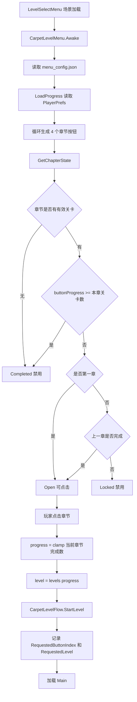

### 4.5 通关推进章节流程图

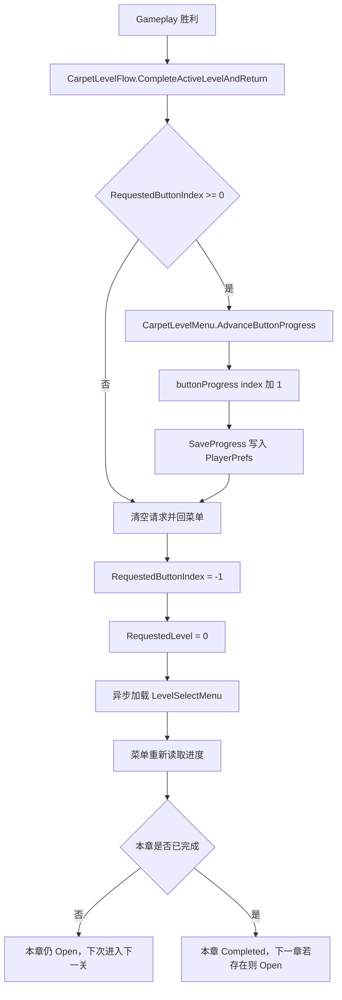

## 5. 模块三：Gameplay 拖动、移动、移动后的钻石下落

### 5.1 当前实现范围

主玩法由 `CarpetGridGame` 完成。它在 `Main` 场景启动时读取 `CarpetLevelFlow.RequestedLevel`，加载对应 JSON 并动态创建棋盘。

当前棋盘表现不是物理下落，而是“钻石堆移动动画 + 路径钻石延迟显现”：

- 玩家按下钻石堆所在格，选中该钻石堆。
- 鼠标或触摸拖过相邻格。
- 超过 `DragStartThresholdPixels = 10` 后进入拖动状态。
- 每隔 `DragStepInterval = 0.055s` 最多推进一格。
- 方向由当前 hover 格相对当前钻石堆位置的行列差决定。
- 移动后给钻石堆记录一段 `CarpetMotion`，渲染时播放 `MoveAnimationDuration = 0.13s` 的移动动画。
- 普通消耗步数的移动会把新路径格加入 `pendingPathReveals`，等待移动动画结束后再显示路径钻石，形成“移动后钻石落下/铺开”的视觉节奏。

### 5.2 当前代码分层

| 层 | 当前类 | 说明 |
| --- | --- | --- |
| Data | `GameState`、`CellData`、`Carpet`、`MoveRecord`、`LevelData`、`MoveInfo`、`MovePlan`、`CarpetMotion` | 棋盘、钻石堆、移动历史、移动判定结果 |
| Controller | `CarpetGridGame` | 输入处理、移动解析、撤回、胜利检测、关卡加载 |
| View | `RenderBoard()` 动态 UI、`CarpetGridCellView`、`CarpetPieceMotion`、`IconButtonGraphic` | 棋盘格、钻石堆、目标角标、路径钻石、动画 |

### 5.3 核心数据类

#### `GameState`

| 字段 | 作用 |
| --- | --- |
| `mode` | 当前模式：`Edit` 或 `Play`，运行游戏时为 `Play` |
| `rows` / `cols` | 棋盘尺寸 |
| `currentLevel` | 当前关卡号 |
| `cells` | 所有格子的路径颜色与归属 |
| `carpets` | 所有钻石堆 |
| `activeId` | 当前选中的钻石堆 ID |
| `pointerDown` / `dragging` | 输入状态 |
| `pressRow` / `pressCol` | 按下时所在格 |
| `hoverRow` / `hoverCol` | 当前拖动经过的格 |
| `pressScreenPosition` | 用于判断是否超过拖动阈值 |
| `nextDragStepTime` | 限制拖动连续移动频率 |
| `lastDragTarget` | 避免同一 hover 目标重复结算 |
| `victory` | 当前关是否已胜利 |

#### `CellData`

| 字段 | 作用 |
| --- | --- |
| `row` / `col` | 格子坐标 |
| `color` | 当前路径颜色，空字符串表示未铺路径 |
| `owner` | 当前路径归属钻石堆 ID，`-1` 表示无归属 |

#### `Carpet`

| 字段 | 作用 |
| --- | --- |
| `id` | 钻石堆 ID |
| `row` / `col` | 当前所在格 |
| `targetRow` / `targetCol` | 目标格 |
| `length` | 剩余可铺步数 |
| `color` | 自身颜色 |
| `groupId` | 同组移动 ID |
| `passColor` | 可免费通过的异色路径颜色 |
| `alive` | 是否有效 |
| `steps` | 已消耗步数 |
| `history` | 移动历史，用于撤回和借道依赖判断 |

#### `MoveRecord`

| 字段 | 作用 |
| --- | --- |
| `fromRow` / `fromCol` | 移动前位置 |
| `toRow` / `toCol` | 移动后位置 |
| `previousColor` / `previousOwner` | 进入目标格前，该格原本的颜色和归属 |
| `borrowedColor` / `borrowedOwner` | 本次免费借道借用的路径信息 |
| `carpetId` | 发起移动的钻石堆 ID |
| `cost` | 本次移动消耗，普通移动为 1，借道为 0 |

### 5.4 核心方法

| 方法 | 作用 |
| --- | --- |
| `LoadSavedLevels()` | 读取关卡 JSON，填充 `savedLevels` |
| `LoadLevel(level)` | 应用指定关卡数据，重置运行态 |
| `ApplyLevelData(data)` | 把 JSON 数据转成 `GameState` |
| `MakeCells(rows, cols)` | 生成棋盘格状态数组 |
| `PaintCarpetStarts()` | 把初始钻石堆所在格染成对应颜色 |
| `OnCellPointerDown()` | 选中钻石堆并记录按下位置 |
| `OnCellPointerEnter()` | 更新 hover 格，达到阈值后尝试移动 |
| `TryMoveTowardHover()` | 根据 hover 方向选择下一步相邻格 |
| `MoveActiveTo(row, col)` | 处理单步移动、同组移动计划和执行 |
| `QueueCarpetMotion()` | 记录钻石堆 UI 移动动画 |
| `QueuePathReveal()` | 记录路径钻石延迟显现 |
| `UpdatePathRevealTimers()` | 到时间后刷新棋盘，使路径钻石出现 |
| `RenderBoard()` | 按当前状态重建棋盘 UI |

### 5.5 棋盘生成算法

当前棋盘运行时全部动态生成，核心步骤：

1. `Awake()` 读取 `CarpetLevelFlow.ConsumeRequestedLevel()`。
2. 若没有请求关卡，说明不是从菜单进入，直接返回菜单。
3. 调用 `ApplyGameArtConfig(requestedLevel)`，读取当前章节背景和棋盘美术。
4. 调用 `LoadSavedLevels()`，扫描关卡目录。
5. 优先使用 `Assets/levels/*.json`；只有该目录不存在时才使用 `Assets/StreamingAssets/Levels/*.json`。
6. 文件名末尾数字作为关卡号，例如 `level-010.json` 解析为 10。
7. `TryLoadLevelJson()` 兼容直接 `LevelData` 和 `{ "level": LevelData }` 两种格式。
8. `LoadLevel(level)` 调用 `ApplyLevelData(data)`。
9. `ApplyLevelData` 创建 `state.cells = MakeCells(rows, cols)`。
10. 遍历 `data.carpets`，创建 `Carpet` 并 clamp 到棋盘范围。
11. `PaintCarpetStarts()` 把每个钻石堆起点格写入 `CellData.color` 和 `CellData.owner`。
12. `Render()` 动态创建棋盘格、目标角标、路径钻石和钻石堆。

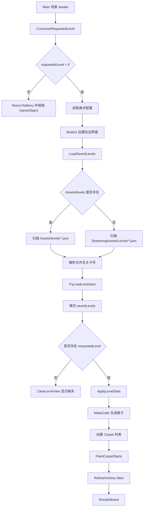

### 5.6 拖动移动流程图

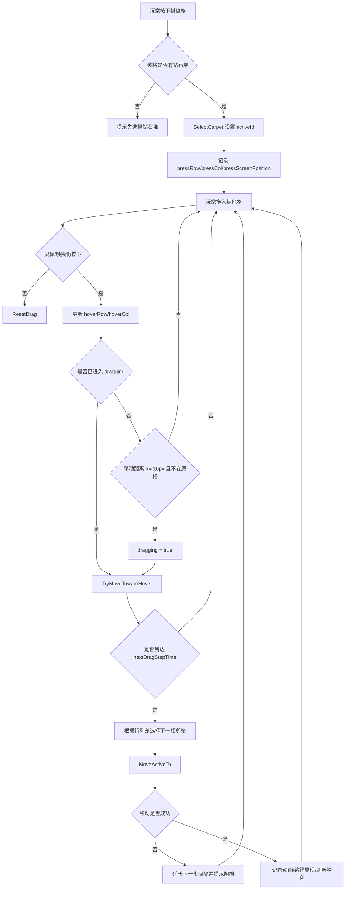

### 5.7 移动后的钻石下落/显现

当前没有刚体物理下落，表现由两个队列控制：

| 队列 | 数据 | 效果 |
| --- | --- | --- |
| `pendingMotions` | `carpetId -> CarpetMotion` | 本帧渲染钻石堆时，从旧位置插值到新位置 |
| `pendingPathReveals` | `row,col,owner -> 时间戳` | 普通移动消耗步数后，路径钻石延迟到动画结束再显示 |

执行步骤：

1. `ExecuteCarpetMove()` 成功移动钻石堆。
2. 调用 `QueueCarpetMotion()` 记录从旧格到新格。
3. 如果 `info.cost > 0`，目标格已经被染色，但调用 `QueuePathReveal()` 把显示延迟到 `Time.unscaledTime + MoveAnimationDuration`。
4. `RenderBoard()` 渲染格子时，如果 `IsPathRevealPending(cell)` 为真，暂不显示路径钻石。
5. `Update()` 每帧调用 `UpdatePathRevealTimers()`。
6. 到时间后移除 pending key，并 `RequestRender()`。
7. 下一次 `RenderBoard()` 显示对应格子的路径钻石。

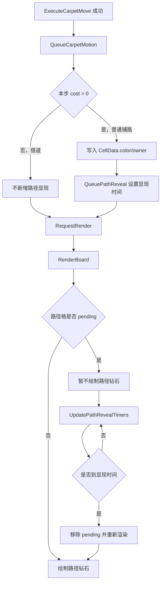

## 6. 模块四：Gameplay 机制

### 6.1 步数、目标检测与胜利

每个钻石堆的 `length` 是剩余资源：

- 普通铺到空格：`length -= 1`，`steps += 1`。
- 免费借道：`length` 不变，`steps` 不变。
- 撤回普通步：`length += 1`，`steps -= 1`。
- 撤回借道步：`length` 不变。

目标检测由 `IsAtTarget(carpet)` 完成，只判断当前位置是否等于 `targetRow/targetCol`。

胜利检测由 `RefreshVictory(announce)` 完成：

```csharp
playable.Count > 0 && playable.All(c => c.length <= 0 && IsAtTarget(c))
```

也就是说，钻石堆必须同时满足：

1. 仍然有效 `alive == true`。
2. 剩余长度用尽 `length <= 0`。
3. 当前坐标位于目标格。

如果只是站在目标格但还有剩余步数，不胜利；如果步数用尽但不在目标格，也不胜利。

### 6.2 单步移动合法性算法

核心方法：`CanMoveCarpetTo(Carpet carpet, int row, int col, HashSet<int> movingIds, HashSet<int> blockedIds)`

输入：

| 参数 | 说明 |
| --- | --- |
| `carpet` | 要移动的钻石堆 |
| `row` / `col` | 目标格 |
| `movingIds` | 本次同组移动中理论上会移动的成员 |
| `blockedIds` | 已确定被阻挡的同组成员 |

输出：`MoveInfo`

| 字段 | 说明 |
| --- | --- |
| `ok` | 是否可移动 |
| `undo` | 是否为撤回 |
| `cost` | 本步消耗，0 或 1 |
| `message` | 阻挡提示 |

判定步骤：

1. 目标格越界，阻挡。
2. 目标格等于当前位置，阻挡。
3. 查找目标格上的钻石堆 `occupant`。
4. 如果目标堆属于同组且本轮也会移动，并且没有被标记阻挡，则视为它会让开。
5. 如果目标堆不会让开，且不是“同色已铺完钻石堆”，则阻挡。
6. 判断是否撤回：目标格是否等于本钻石堆最后一步的 `fromRow/fromCol`。
7. 如果是撤回，检查当前位置是否被其他钻石堆作为借道依赖；若被依赖，阻挡，否则允许撤回，消耗返还为最后一步 `cost`。
8. 非撤回时，读取目标 `CellData`。
9. 如果目标格是不可通行的异色路径，阻挡。
10. 如果目标格是自己的路径，且不是撤回，阻挡，强制只能沿最近一步撤回。
11. 如果剩余 `length <= 0`，阻挡。
12. 计算是否免费：同色已铺完钻石堆、指定 `passColor` 路径、或非自己拥有的同色路径。
13. 返回允许移动，`cost = freePass ? 0 : 1`。

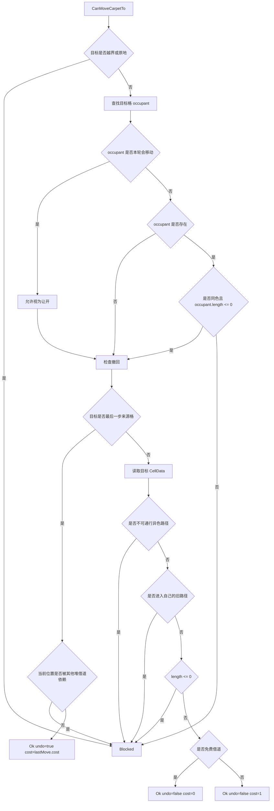

### 6.3 借道机制

当前实现有 3 类免费借道：

| 借道类型 | 判定方法 | 说明 |
| --- | --- | --- |
| 同色路径借道 | `target.color == carpet.color && target.owner != carpet.id` | 前方已有同色钻石路径时免费通过 |
| 同色已完成堆借道 | `IsPassableSameColorEnd(occupant, carpet)` | 前方是同色、且该堆 `length <= 0` 时可穿过 |
| 指定异色路径借道 | `IsPassColorCell(cell, carpet)` | 关卡数据配置 `passColor` 后，可通过该颜色路径 |

借道不会覆盖原格的 `CellData.color/owner`，但会记录 `MoveRecord.borrowedColor/borrowedOwner`，用于后续撤回依赖判断。

#### 为什么要有借道依赖

如果 A 钻石堆免费借用了 B 的路径格，而 B 立即撤回并清掉该路径，A 的历史记录就会失去语义依赖。当前代码用 `FindBorrowDependency(ownerCarpet, row, col)` 防止这种情况：

- 当某堆尝试撤回当前所在格时，检查其他钻石堆的历史中是否有 `cost == 0` 且 `toRow/toCol` 指向该格的借道记录。
- 如果存在，则提示需要先让借道者撤回。
- 这样保证被借用路径不会被提前拆除。

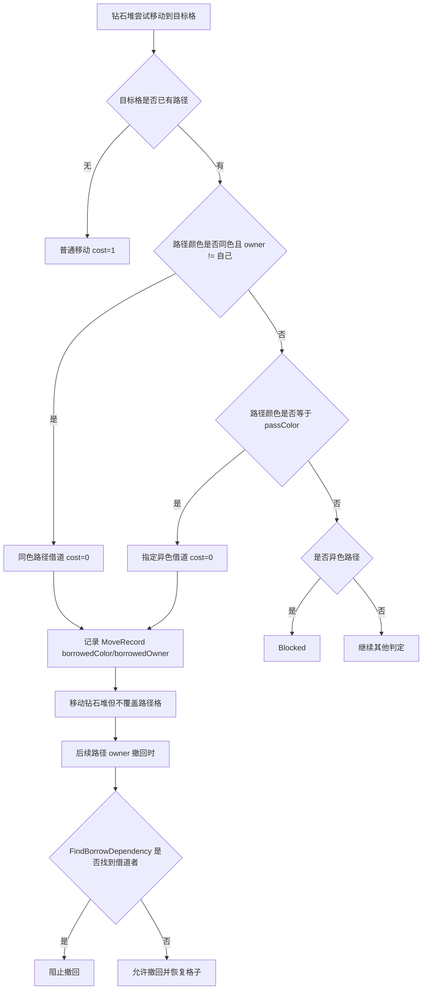

### 6.4 同组同时出发算法

同组移动由 `groupId` 控制。只要被拖动的钻石堆有非空 `groupId`，`GetMoveGroup()` 会取出全部同组存活钻石堆。

核心设计点：同组成员一起尝试同方向移动，但阻挡是独立的。一堆被挡住，不影响没被挡住的成员继续移动。

算法步骤：

1. 玩家拖动某个钻石堆，算出本次方向 `deltaRow/deltaCol`。
2. `GetMoveGroup(carpet)` 取出所有同 `groupId` 成员；无组则只有自身。
3. 为每个成员生成 `MovePlan`，目标为自身当前位置加同一个 delta。
4. `movingIds` 包含所有理论移动成员。
5. 初始化 `blockedIds` 为空。
6. 进入循环，对每个未阻挡成员调用 `CanMoveCarpetTo()`。
7. 如果某成员被阻挡，加入 `blockedIds`。
8. 因为某成员被阻挡后，其他成员原本以为它会让开的格子可能不再可走，所以循环重新检查，直到没有新增阻挡。
9. 剩余可移动成员按方向排序执行，避免前后顺序导致互相占位误判。
10. 对每个可移动成员调用 `ExecuteCarpetMove()`。
11. 如果部分成员被阻挡且部分成功移动，提示“组内有 N 块被阻挡，其余已移动”。

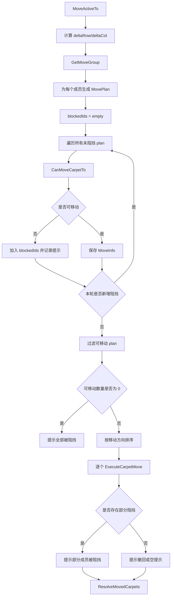

### 6.5 执行移动与撤回

核心方法：`ExecuteCarpetMove(Carpet carpet, int row, int col, MoveInfo info)`

#### 普通移动或借道

1. 获取目标格 `target`。
2. 创建 `MoveRecord`：
   - 记录从哪里来、到哪里去。
   - 记录目标格原本颜色和 owner。
   - 如果 `cost == 0`，记录借道颜色和 owner。
3. 如果 `cost > 0`：
   - 把目标格写成当前钻石堆颜色和 owner。
   - 加入路径延迟显现队列。
4. 加入钻石堆移动动画队列。
5. 更新钻石堆 `row/col`。
6. `length -= cost`。
7. `steps += cost`。

#### 撤回

1. 读取最后一条 `MoveRecord`。
2. 当前格恢复为 `previousColor/previousOwner`。
3. 取消当前格路径显现 pending。
4. 加入钻石堆从当前格回到上一格的动画。
5. 更新钻石堆 `row/col` 为 `fromRow/fromCol`。
6. `length += cost`。
7. `steps -= cost`。
8. 删除最后一条历史。

### 6.6 目标与胜利检测流程图

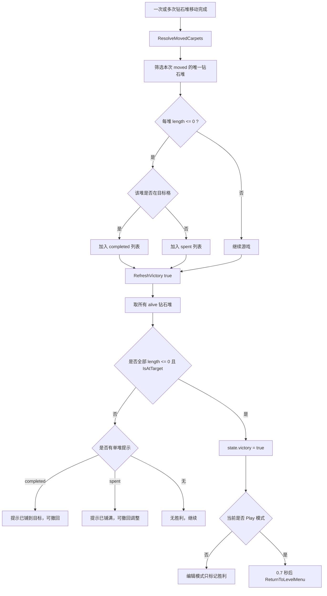

## 7. 模块五：Gameplay 推关

### 7.1 当前实现范围

推关由 `CarpetGridGame.RefreshVictory()` 和 `CarpetLevelFlow.CompleteActiveLevelAndReturn()` 串联完成。

关内没有“下一关按钮”。胜利后自动等待 0.7 秒返回主界面，并推进章节进度：

- 如果当前章节还有下一关，则主界面该章节仍可点击，点击后进入下一关。
- 如果当前章节全部完成，则该章节显示已完成并禁用。
- 如果存在下一章节，下一章节解锁并可点击。

### 7.2 当前代码分层

| 层 | 当前类 | 说明 |
| --- | --- | --- |
| Data | `buttonProgress`、`RequestedLevel`、`RequestedButtonIndex` | 推关状态 |
| Controller | `CarpetGridGame`、`CarpetLevelFlow`、`CarpetLevelMenu` | 胜利判断、通关通知、进度推进、菜单重建 |
| View | Toast、章节按钮状态 | 胜利提示、章节锁定/开放/完成表现 |

### 7.3 关内推关流程

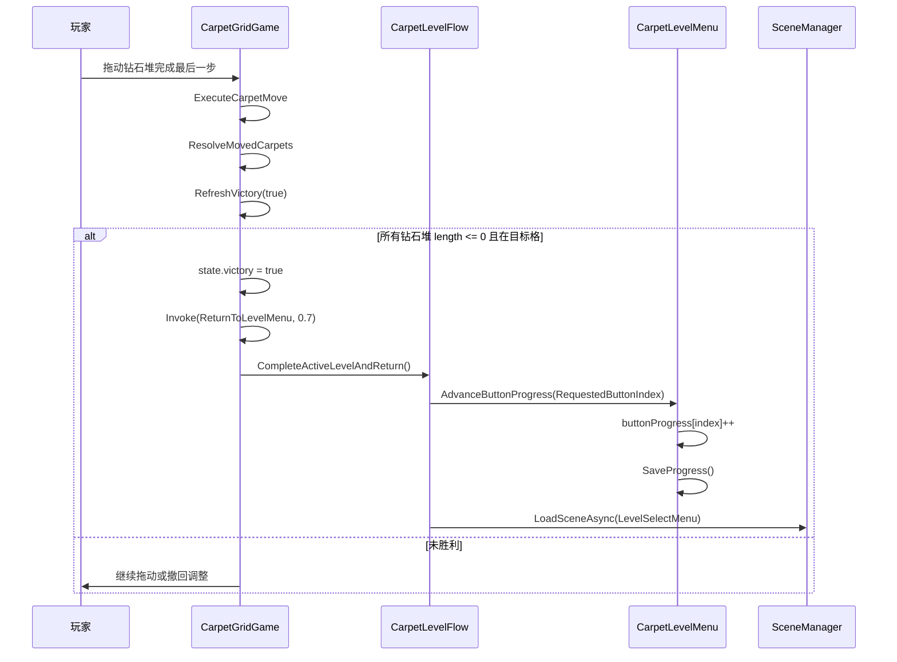

### 7.4 回主界面后的关卡选择

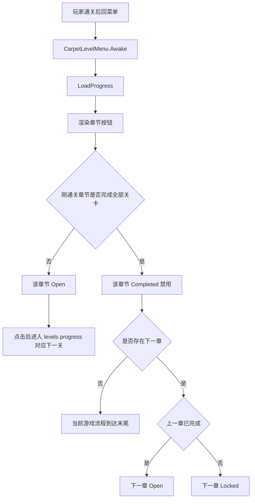

### 7.5 返回与重置

当前有两种非胜利离开：

| 操作 | 方法 | 是否推进进度 |
| --- | --- | --- |
| 玩法界面返回按钮 | `CarpetLevelFlow.ReturnToMenu()` | 否 |
| 菜单重置游戏 / 主玩法重开按钮 | `CarpetLevelFlow.ResetGameAndReturnToIntro()` | 清空全部进度，并回 Intro |

注意：当前主玩法中的“重开”按钮不是只重置当前关，而是完整重置游戏进度并返回开场。这是代码当前行为。

## 8. 美术、音频与配置加载设计

### 8.1 玩法美术配置

`Assets/StreamingAssets/Art/game_art_config.json` 配置全局与按章节覆盖：

| 字段 | 说明 |
| --- | --- |
| `sceneBackground` | 玩法场景背景 |
| `boardBackground` | 棋盘背景 |
| `boardCell` | 棋盘格图片 |
| `carpet` | 钻石堆图片 |
| `target` | 目标格图片，当前可为空 |
| `backIcon` | 返回按钮图标 |
| `restartIcon` | 重置按钮图标 |
| `sceneBackgroundColor` | 背景色 |
| `boardBackgroundColor` | 棋盘底色 |
| `emptyCellColor` | 空格底色 |
| `chapters` | 按章节或关卡覆盖配置 |

章节配置匹配规则：

1. 优先用 `CarpetLevelFlow.RequestedButtonIndex` 匹配章节索引。
2. 支持 `chapterIndex` 一基和零基匹配。
3. 如果章节索引无法匹配，再根据 `levels` 是否包含当前关卡匹配。

### 8.2 菜单美术配置

`menu_config.json` 当前支持：

- 背景色与背景图。
- 最多 4 个章节按钮：文案、关卡列表、坐标、尺寸、旋转。
- 装饰图：图片、位置、尺寸、旋转、颜色、阴影、呼吸动画。
- 装饰帧动画：`animationFrames` 和 `animationDurations`。
- 触发动画文件夹：`triggerAnimationFolders`，按数值后缀排序加载帧。
- 背景动画：`animations`，当前内置矩形 Tween，也预留 `ICarpetMenuBackgroundAnimation` 扩展。

### 8.3 BGM

`CarpetBgmPlayer` 使用 `DontDestroyOnLoad` 跨场景保留：

| 方法 | 说明 |
| --- | --- |
| `EnsurePlaying()` | 确保 BGM 对象、AudioSource 和音频资源存在 |
| `ApplySavedSetting()` | 根据 PlayerPrefs 声音开关应用音量 |
| `RestartFromBeginning()` | 重置流程时从头播放 |
| `SyncAudioListener()` | 如果场景中没有可用 AudioListener，则启用自己的 Listener |

音频资源路径固定为：

```text
Assets/Resources/Audio/perfect_beauty_bgm.mp3
```

运行时加载路径：

```text
Audio/perfect_beauty_bgm
```

## 9. 当前实现的主要限制与接手风险

1. `CarpetGridGame.cs` 体量很大  
   它同时处理关卡数据、玩法规则、UI 构建、渲染、编辑器模式和动画。后续要改规则时，建议先围绕 `CanMoveCarpetTo()`、`ExecuteCarpetMove()`、`MoveActiveTo()` 做局部测试或拆分。

2. data/controller/view 不是物理分文件  
   文档中的分层是职责分层。真实类目前主要集中在单文件里。

3. 章节按钮数量硬编码为 4  
   `ChapterButtonCount = 4`。如果策划需要更多章节，必须改代码。

4. 关卡源存在双目录  
   当前优先读取 `Assets/levels`。如果该目录存在，`Assets/StreamingAssets/Levels` 不会被使用。关卡维护时要避免改错目录。

5. 主玩法重开按钮行为偏“全局重置”  
   现在调用 `ResetGameAndReturnToIntro()`，会清空章节进度并回开场，不是传统的重开当前关。

6. 开场与部分旧文案曾有编码问题  
   当前文档已重写为 UTF-8，但代码内部分字符串仍可见乱码。功能通常不受影响，但 UI 文案需要后续统一修复。

7. 引导系统只接入了开场进入菜单这一条链路  
   `GuideTextType` 已预留章节解锁、结尾等枚举值，但当前没有对应触发点；`LevelFoueEndDialogue.asset` 文件名也带拼写错误，后续扩展时要先统一命名和触发条件。

8. 新菜单强依赖预制体命名与层级  
   `CarpetLevelMenu` 会按 `Root`、`ButtonLayer`、`SettingsPanel`、`GuideBox`、`Mask` 等名字递归查找节点；UI 改层级或改名后，运行期会退化为告警或缺功能。

9. 缺少自动化测试  
   当前未看到 Unity Test Runner 测试。移动规则复杂，建议优先补以下测试：普通移动、撤回、同色借道、指定异色借道、借道依赖、同组部分阻挡、胜利检测。

## 10. 建议的后续重构分层

在不改变玩法规则的前提下，建议将 `CarpetGridGame` 逐步拆成以下结构：

| 建议类 | 层 | 迁移职责 |
| --- | --- | --- |
| `LevelStore` | Data / Service | 扫描 JSON、解析关卡号、加载关卡数据 |
| `BoardState` | Data | `GameState`、`CellData`、`Carpet`、移动历史 |
| `MoveResolver` | Controller / Domain | `CanMoveCarpetTo`、借道、撤回、同组移动 |
| `VictoryResolver` | Controller / Domain | `IsAtTarget`、`RefreshVictory` |
| `BoardRenderer` | View | `RenderBoard`、路径钻石、目标显示、棋盘格 |
| `GameHud` | View | 返回、重置、关卡标题、Toast |
| `LevelProgressService` | Service | 章节进度 PlayerPrefs 读写 |
| `IntroPlaybackController` | Controller | 开场/结尾视频通用播放 |

拆分优先级建议：

1. 先抽 `MoveResolver`，因为玩法 bug 多半集中在这里。
2. 再抽 `LevelStore`，减少关卡加载和玩法逻辑耦合。
3. 最后抽 `BoardRenderer`，避免在规则尚未稳定时大改 UI。

## 11. 策划验收清单

### 11.1 全流程验收

1. 从 `Intro.unity` 进入 Play。
2. 确认 Logo、开始按钮出现。
3. 点击开始，剧情文字逐字显示。
4. 点击未显示完的剧情，能立即补全文字。
5. 剧情结束后再次点击，播放视频。
6. 视频结束或失败后进入章节菜单。
7. 首次进入章节菜单时先弹出 `StartGameDialogue` 引导框，点击按钮可关闭。
8. 初始状态只有章节一可点击，章节二到四禁用。
9. 点击章节一进入关卡 1。
10. 通关后自动返回菜单。
11. 再次点击章节一进入关卡 2。
12. 章节一全部完成后，章节一禁用并显示已完成，章节二解锁。
13. 按同样方式推进章节二、三、四。

### 11.2 玩法规则验收

1. 拖动钻石堆只能沿上下左右相邻格移动。
2. 进入空格消耗 1 点 `length`。
3. 钻石堆走过的格子会显示自身颜色路径。
4. 移动动画后路径钻石延迟显现。
5. 沿最近一步反向拖动可以撤回。
6. 撤回普通步会返还 `length`。
7. 不能进入异色路径。
8. 可以免费通过非自己拥有的同色路径。
9. 可以免费通过 `passColor` 指定的异色路径。
10. 可以穿过同色且 `length <= 0` 的钻石堆。
11. 不能穿过同色但尚未铺完的钻石堆。
12. 同组钻石堆一起尝试移动。
13. 同组中某堆被阻挡时，其他可移动成员继续移动。
14. 全部钻石堆 `length <= 0` 且停在目标格时胜利。
15. 铺满但未到目标时不失败，可撤回调整。

### 11.3 数据验收

1. 修改 `Assets/levels/level-001.json` 后，运行关卡 1 能看到变化。
2. 文件名 `level-010.json` 能解析为关卡 10。
3. `menu_config.json` 的章节关卡映射与菜单按钮一致。
4. `game_art_config.json` 的章节背景与进入关卡所属章节一致。
5. 菜单设置里关闭声音后，BGM 立即静音。
6. 重置游戏后章节进度清空，并返回 Intro。

## 12. 变更记录

### 2026-07-09 技术文档重写

- 将原有编码损坏的 `DEVELOPMENT_HANDOFF.md` 重写为 UTF-8 中文技术文档。
- 按当前代码整理完整游戏框架流程。
- 按模块补充开场/结尾、主界面章节解锁、Gameplay 拖动与移动表现、Gameplay 规则机制、Gameplay 推关。
- 补充 data/controller/view 职责分层说明。
- 补充核心类、属性、方法、算法步骤和 Mermaid 流程图。
- 明确当前代码真实限制：主玩法单类集中、章节数量硬编码、关卡双目录、重开按钮清全局进度、缺少自动化测试。

### 2026-07-09 菜单引导与预制体同步

- 模块影响：`IntroSceneController` 在开场视频结束后会预约菜单引导；`CarpetLevelMenu` 改为优先加载 `Resources/Prefabs/Carpet Level Menu` 并绑定场景现有节点；`CarpetLevelFlow` 新增菜单引导暂存状态。
- 行为变化：玩家首次从开场进入主界面时，会先看到 `GuideLayerController` 驱动的引导气泡，再进行章节选择。
- 数据与资源变化：新增 `GuideDialogueConfig`、`GuideTextType`、`GuideLayerController` 脚本；新增 `Assets/Resource/GuideDialogue/StartGameDialogue.asset`、`LevelFoueEndDialogue.asset`；主界面新增菜单预制体、章节按钮预制体和 `output_jianing.png` 角色图；`Packages/manifest.json` 新增 `com.unity.2d.sprite` 依赖。
- 验收方式：从 `Intro.unity` 进入 Play，走完整个开场流程，确认主界面首次加载时出现引导框且可点击关闭，再验证章节按钮、设置按钮和装饰图都已绑定成功。
- 接手风险：引导系统目前只消费 `StartGame` 文案，其他枚举和结尾文案尚未接线；菜单脚本对预制体命名和层级有隐式依赖，UI 调整时必须回归验证。

### 2026-07-09 Animation 包依赖同步（origin/main）

- 模块影响：`Packages/manifest.json` 与 `Packages/packages-lock.json` 新增 `com.unity.2d.animation` 及其传递依赖，属于工程包层面的远端同步变更。
- 行为变化：当前代码里还没有直接调用新的 Animation API，但 Unity 编辑器在打开项目时会多加载 2D Animation 相关程序集和内置模块，后续菜单帧动画或角色骨骼资源可以直接接入。
- 数据与资源变化：远端提交 `1097fa7 feat: 新增animation包` 只改动 `Packages/manifest.json`、`Packages/packages-lock.json`，当前本地已同步到该包版本。
- 验收方式：重新打开 Unity，确认 Package Manager 中存在 `2D Animation 9.2.2`，控制台没有缺失程序集或包解析错误。
- 接手风险：该依赖目前来自远端同步；如果其他开发机尚未拉取 `1097fa7`，打开项目时可能出现 `Packages` 解析结果不一致，协作前需先统一包版本。

### 2026-07-09 钻石预制体渲染与方向标识调整

- 模块影响：`CarpetGridGame` 改为通过 `Resources/DiamondPrefab/DiamondPrefab` 渲染棋盘钻石与路径钻石；`Assets/Resources/DiamondPrefab/DiamondPrefab.prefab` 新增文本节点和方向装饰节点；新增 `Assets/Font/WhiteFillBlackOutlineText.shader`、`Assets/Font/WhiteFillBlackOutlineText.mat` 供数字描边显示。
- 行为变化：棋盘上的钻石堆不再直接用代码画单层 `Image + Text`，而是实例化统一预制体；移动和撤销都会记录最近一次方向，渲染时显示金/银方向标识；同色双堆场景会根据 `HasSameColorPair()` 切到银色方向装饰，路径钻石也复用同一套预制体外观。
- 数据与资源变化：`Carpet.hasMoveDirection`、`lastDirectionRow`、`lastDirectionCol` 三个运行时字段用于保存最近方向；字体材质和描边 Shader 目前还是未提交资源，若删除或改名，预制体文本会退化或丢失样式。
- 验收方式：在 `Main.unity` 进入 Play，拖动任意钻石堆并执行一次撤销，确认钻石数字仍可见、方向标识会随最近移动方向旋转；再验证同色双堆关卡会显示银色方向装饰，路径菱形仍按占格颜色渲染。
- 接手风险：该套渲染强依赖预制体内 `10_DiamondNormal`、`20_DiamondSmall`、`30_DirectionGold`、`31_DirectionSilver` 等子节点命名，以及字体材质路径；若美术继续改预制体层级，`FindChildRecursive()` 找不到节点时会静默退回旧 `Image` 样式，容易出现表现不一致但无明显报错。

### 2026-07-09 棋盘视觉、胜利判定与菜单动态背景同步

- 模块影响：`BoardVisualConfig` 与 `CarpetGridGame` 将场景背景和棋盘背景统一收口到同一张背景图；`CarpetGridGame.RefreshVictory()` 的胜利判定改为按“同色任一目标格 + 目标占位不重复”计算；`Assets/Resources/Prefabs/Carpet Level Menu.prefab`、`Assets/StreamingAssets/Menu/menu_config.json` 以及 `Assets/Resource/Animation/{Cloud,CloudGroup,Bird,BirdGroup}` 为主菜单补入云朵、飞鸟和章节映射调整。
- 行为变化：关卡内不再区分独立的棋盘底图与场景底图，棋盘滚动区透明后直接叠在统一背景上；同色钻石堆只要分别停在任一同色目标格上即可判定完成，但两个堆不能占用同一目标格“重叠通关”；主菜单现在会持续播放云层和鸟群动画，章节入口从 `1-2 / 3-4 / 5-6 / 7` 调整为 `1-3 / 4-6 / 7-8 / 9`。
- 数据与资源变化：关卡数据新增或调整 `Assets/levels/level-006.json`、`level-008.json`、`level-009.json`；`BoardVisualConfig.asset` 字段从 `boardBackground*` 改为共享 `background*`；菜单预制体新增 `Clouds`、`Birds`、`Statue` 节点并绑定对应 Animator Controller，云朵与鸟群帧动画资源位于 `Assets/Resource/Animation` 和 `Assets/Resources/Menu/animation`。
- 验收方式：在 `Main.unity` 进入 Play，重点验证同色双堆关卡中两个钻石堆分别停在不同同色目标格时才能触发胜利，同时确认统一背景下棋盘滚动区没有额外底板遮挡；在 `LevelSelectMenu.unity` 进入 Play，确认云朵与鸟群循环播放、四个章节按钮仍能按新关卡分组进入正确关卡。
- 接手风险：胜利条件已经从“各自固定 target”放宽到“同色目标集合”，后续如果策划重新依赖单一目标位，需要同步回看 `IsAtAnySameColorTarget()` 与 `OccupiesDistinctTargetCells()`；菜单动态背景目前直接绑在预制体层级和 Animator 上，若 UI 再次改层级或替换资源，最容易回归出动画不播放、按钮点击区被装饰层遮挡或章节映射与文档不一致的问题。
